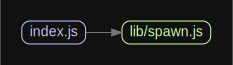

# 源码分析

## 文件结构

``` bash
/Users/liufang/openSource/FunnyLiu/npm-lifecycle
├── index.js - 入口文件，核心方法runCmd，调用spawn.js来执行命令
├── lib
|  └── spawn.js - 基于原生child_process模块来执行子shell命令
├── node-gyp-bin
|  ├── node-gyp
|  └── node-gyp.cmd

directory: 7 file: 20

ignored: directory (2)

```

## 外部模块依赖

请在： http://npm.broofa.com?q=npm-lifecycle 查看

## 内部模块依赖


  
## 功能说明

主要负责npm包真正执行命令时的shell进程

# Note: pending imminent deprecation

**This module will be deprecated once npm v7 is released.  Please do not rely
on it more than absolutely necessary.**

The lifecycle script runner used in npm v7 is
[@npmcli/run-script](http://npm.im/@npmcli/run-script).  Please use that
module moving forward.

-----

# npm-lifecycle

[`npm-lifecycle`](https://github.com/npm/npm-lifecycle) is a standalone library for
executing packages' lifecycle scripts. It is extracted from npm itself and
intended to be fully compatible with the way npm executes individual scripts.

## Install

`$ npm install npm-lifecycle`

## Table of Contents

* [Example](#example)
* [Features](#features)
* [Contributing](#contributing)
* [API](#api)
  * [`lifecycle`](#lifecycle)

### Example

```javascript
// idk yet
```

### API

#### <a name="lifecycle"></a> `> lifecycle(name, pkg, wd, [opts]) -> Promise`

##### Arguments

* `opts.stdio` - the [stdio](https://nodejs.org/api/child_process.html#child_process_options_stdio)
passed to the child process. `[0, 1, 2]` by default.

##### Example

```javascript
lifecycle()
```
